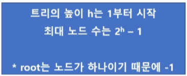
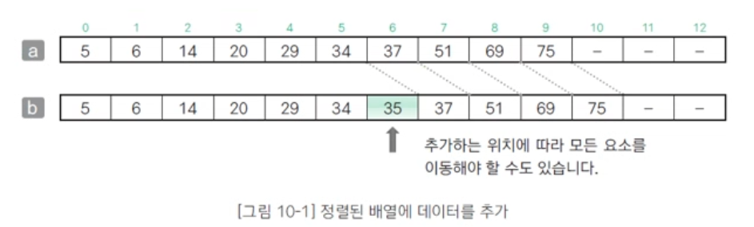
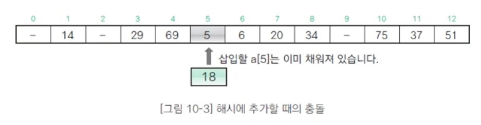
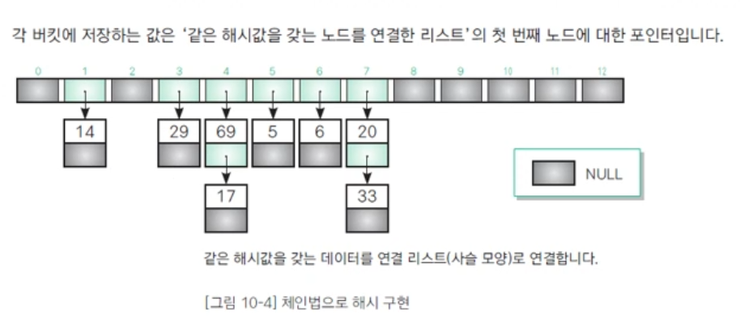
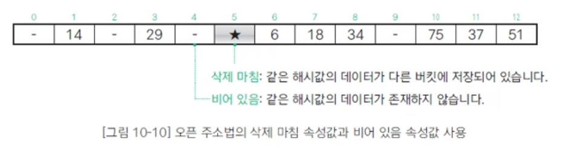
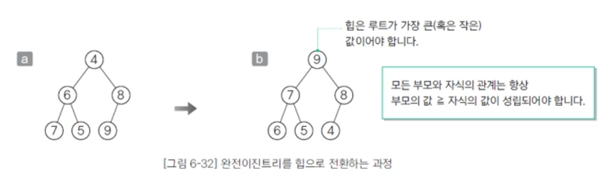
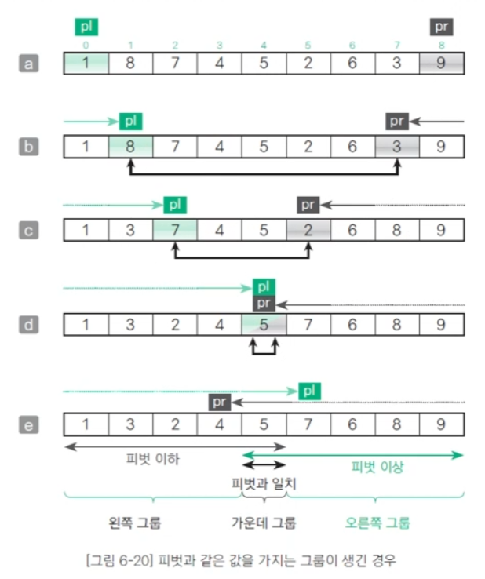

# 김성미
### 202330203

---

# 11-27 14주차 강의

# 


---


# 11-20 13주차 강의

# 트리

## 트리 관련 용어
* 트리를 구성하는 요소는 <u>노드(node)와 가지(edge)</u>
* 각각의 노드는 가지를 통해 다른 노드와 연결되어 있음
* <u>루트(root)</u>
    * 트리의 <u>가장 윗부분</u>에 위치하는 노드
    * <u>하나의 트리에는 하나의 루트</u>가 있음
    * 그림을 거꾸로 보면 나무 모양과 비슷함
* <u>리프(leaf)</u>
    * 트리의 <u>가장 아랫부분에 위치하는 노드</u>
    * '가장 아래에 위치한다'라는 말은 물리적으로 가장 아랫부분에 위치한다는 의미가 아니라 <u>더 이상 뻗어나갈 수 없는 마지막에 노드</u>가 위치한다는 의미
* 안쪽 노드
    * 루트를 포함하여 리프를 제외한 노드
* 자식(child)
    * 어떤 노드로부터 가지로 연결된 아래쪽 노드
    * 노드는 자식을 여러 개 가질 수 있음
* 부모(parent)
    * 어떤 노드에서 가지로 연결된 위쪽 노드
    * 노드는 1개의 부모를 가짐
* 형제(sibling)
    * 같은 부모를 가지는 노드
* <u>조상(ancestor)</u>
    * 어떤 노드에서 가지로 연결된 <u>위쪽 노드 모두</u>
* <u>자손(descendant)</u>
    * 어떤 노드에서 가지로 연결된 <u>아래쪽 노드 모두</u>
* <u>레벨(level)</u>
    * <u>루트로부터 얼마나 떨어져 있는지에 대한 값</u>
    * <u>루트의 레벨은 0</u>이고 루트로부터 가지가 하나씩 아래로 뻗어나갈 때마다 레벨이 1씩 늘어남
* <u>차수(degree)</u>
    * <u>노드가 갖는 자식의 수</u>
    * <u>모든 노드의 차수가 n 이하인 트리를 n진 트리라고 함</u>
* <u>높이(height)</u>
    * <u>루트부터 가장 멀리 떨어진 리프까지의 거리 (리프 레벨의 최댓값)</u>
* <u>서브 트리(subtree)</u>
    * 트리 안에서 <u>다시 어떤 노드를 루트로 정하고 그 자손으로 이루어진 트리</u>
* <u>널 트리(null tree)</u>
    * <u>노드, 가지가 없는 트리</u>

## 순서 트리와 무순서 트리
* <u>형제 노드의 순서가 있는지 없는지에 따라 트리를 두 종류로 분류</u>
* 형제 노드의 순서를 따지면 순서 트리(ordered tree), 따지지 않으면 무순서 트리(unordered tree)라고 함

## 순서 트리의 탐색 방법
* 너비 우선 탐색(breadth-first Search)
    * <u>낮은 레벨에서 시작해 왼쪽에서 오른쪽 방향으로 검색</u>하고 한 레벨에서의 검색이 끝나면 다음 레벨로 내려감
    * 검색순서: A → B → C → D → E → F → G → H → I → J → K → L
* 깊이 우선 탐색(depth-first Search)
    * <u>리프까지 내려가면서 검색</u>하는 것을 우선순위로 하는 탐색 방법
    * <u>리프에 도달해 더 이상 검색을 진행할 곳이 없는 경우에는 부모 에게 돌아감</u>
    * 그런 다음 <u>다시 자식 노드로 내려감</u>
    * 그림은 노드 A를 몇 번 지나갔는지를 나타낸 것
    * 두 자식 가운데 한쪽(또는 양쪽)이 없으면 노드를 지나가는 횟수가 줄어들겠지만 <u>노드를 지나가는 최댓값은 3회</u>


* 깊이 우선 탐색에서 가능한 노드 방문 종류
* <u>전위 순회(Preorder)</u>
    * (부모)노드 방문 → 왼쪽 자식 → 오른쪽 자식
    * <u>A → B → D → H</u> → <u>E → I</u> → <u>J → C → F → K</u> → L → G
* <u>중위 순회(Inorder)</u>
    * 왼쪽 자식 → (부모) 노드 방문 → 오른쪽 자식
    * H → D → B → I → E → J → A → K → F → L → C → G
* 후위 순회(Postorder)
    * <u>왼쪽 자식 → 오른쪽 자식</u> → (부모) 노드 방문
    * <u>H → D</u> → <u>I → J → E</u> → B → <u>K → L → F</u> → G → C → A


# 이진트리와 이진검색트리

## 이진트리(binary tree)
* 노드가 <u>왼쪽 자식과 오른쪽 자식을 갖는 트리</u>
* 노드의 <u>자식은 2명 이하만 유지</u>해야 함
* 왼쪽 자식과 오른쪽 자식을 구분함
* <u>왼쪽 자식을 다시 루트로 하는 서브 트리</u>를 왼쪽 서브 트리(left subtree), <u>오른쪽 자식을 다시 루트로 하는 서브 트리</u>를 오른쪽 서브 트리(right subtree)라고 함

## 완전이진트리(complete binary tree)
* 루트부터 노드가 채워져 있으면서 <u>같은 레벨에서는 왼쪽에서 오른쪽으로 노드가 채워져 있는 이진트리</u>
    1. 마지막 레벨을 제외한 레벨은 노드를 가득 채움</u>
    2. 마지막 레벨은 왼쪽부터 오른쪽 방향으로 노드를 채우되 <u>반드시 끝까지 채울 필요는 없음</u>
* <u>높이가 k인 완전이진트리가 가질 수 있는 노드의 최댓값</u>은 2ᵏ⁺¹-1개
* 따라서 n개의 노드를 저장할 수 있는 완전이진트리의 높이는 log n
* 완전이진트리에서 너비 우선 탐색을 하며 각 노드에 0, 1, 2, ... 값을 주면 배열에 저장하는 인덱스와 일대일로 대응



## 보충 설명
* 트리의 <u>레벨(level)은 루트에서부터 노드까지 거친 층의 수</u>를 나타내며, <u>루트는 보통 0레벨 또는 1레벨</u>로 본다.
* <u>높이(height)는 트리의 최대 레벨</u>과 같으며, <u>루트에서 가장 먼 리프 노드까지의 경로에 있는 레벨 수</u>(혹은 <u>간선의 최대 개수</u>)를 의미한다.
* 높이가 h일 때 최대 노드의 수 n은: n = 2ʰ-1 (단, 높이를 1서부터 시작)
* n개의 노드를 가질 때, 완전 이진트리의 최대 높이 h는: h = log₂ n + 1 (단, 높이를 1서부터 시작)

## 이진검색트리(binary Search tree)
* 이진트리가 다음의 조건을 만족
    1. 어떤 노드 N을 기준으로 <u>왼쪽 서브 트리 노드의 모든 키값은 노드 N의 키값보다 작아야 함</u>
    2. <u>오른쪽 서브 트리 노드의 키값은 노드 N의 키값보다 커야 함</u>
    3. <u>같은 키값을 갖는 노드는 없음</u>
* 이진검색트리의 특징
    * <u>구조가 단순함</u>
    * <u>중위 순회를 하면 키값의 오름차순</u>으로 노드를 얻을 수 있음
    * <u>이진검색과 비슷한 방식</u>으로 빠르게 검색할 수 있음
    * <u>노드를 삽입하기 쉬움</u>


# 해시법

## 정렬된 배열에 데이터를 추가
* ⓐ배열의 앞쪽 10개의 요소에 데이터가 오름차순으로 정렬된 상태로 저장
* 배열에 <u>35를 추가하려면</u> 아래와 같은 작업이 필요
    1. 삽입할 위치가 <u>a[5]와 a[6] 사이임을 이진검색법으로 조사</u>
    2. 그림 ⓑ와 같이 <u>a[6] 이후의 모든 요소를 하나씩 뒤로 이동</u>
    3. <u>a[6]에 35를 대입</u>
* 요소 이동에 필요한 복잡도(time-complexity)는 O(n)이며 이 비용은 적은 비용이 아님



## 해시법(hashing)
* 데이터를 <u>저장할 위치(인덱스)를 간단한 연산으로 구하는 것</u>으로, <u>검색뿐만 아니라 추가, 삭제도 효율적</u>으로 수행하는 방법
* 그림의 ⓐ에서 볼 수 있는 배열의 키값(각 요솟값)을 <u>배열의 요소 개수 13으로 나눈 나머지로 다시 정리</u>하면 표와 같음
* 표에 <u>정리한 값을 해시값(hash value)</u>이라고 하며, 이 <u>해시값은 데이터에 접근할 때 사용</u>
* <u>해시값이 인덱스가 되도록 원래의 키값을 저장</u>한 배열이 해시 테이블(hash table)
* 배열에 35를 추가하는 경우 <u>35를 13으로 나눈 나머지 는 9</u>이므로 ⓑ처럼 <u>a[9]에 값(35)을 저장</u>
* 이전의 '추가한 값' 이후의 배열 요소를 모두 옮겼던 경우와는 다르게 <u>새로운 값을 추가하더라도 다른 배열 요소를 뒤로 옮기지 않아도 됨</u>
* 이렇게 <u>키값(35)을 가지고 해시값(9)을 만드는 과정을 해시 함수(hash function)</u>라고 함
* 해시 함수는 여기에서 살펴봤듯이 '나머지를 구하는 연산 또는 이런 나머지 연산을 다시 응용한 연산'을 사용
* 해시 테이블의 각 요소를 버킷(bucket)이라고 함

을 추가")

## 충돌(collision)
* <u>저장할 버킷이 중복되는 현상</u>
* 배열에 새로운 값 <u>18을 추가</u>하는 경우 18을 13으로 나눈 나머지인 <u>해시값은 5이고 저장할 곳은 버킷 a[5]</u>
* 그런데 그림처럼 이 버킷은 <u>이미 채워져 있음</u>
* 키값과 해시값의 대응 관계가 <u>반드시 1대1이라는 보증은 없음(보통 n대1)</u>
* 충돌에 대한 대처
    1. 체인법: 같은 해시값을 갖는 요소를 연결 리스트로 관리
    2. 오픈 주소법: 빈 버킷을 찾을 때까지 해시를 반복



## 체인법(chaining)
* 해시값을 갖는 <u>데이터를 쇠사슬(chain) 모양으로 연결 리스트에서 연결하는 방법</u>으로, <u>오픈 해시법(open hashing)</u>이라고도 함

## 같은 해시값을 갖는 데이터 저장하기
* 배열의 각 버킷(해시 테이블)에 저장하는 값은 그 인덱스를 해시값으로 하는 연결 리스트의 첫 번째 노드(node)에 대한 포인터
    * 그림에서 69와 17의 해시값은 모두 4이며, 이들을 연결하는 연결 리스트의 첫 번째 노드에 대한 포인터를 table[4]에 저장
    * 또 해시값(인덱스) 0과 2처럼 데이터가 하나도 없는 버킷의 값은 (NULL) 포인터값을 저장



## 오픈 주소법(open addressing)
* <u>충돌이 발생했을 때 재해시(rehashing)를 수행하여 비어 있는 버킷을 찾아내는 방법</u>으로, <u>닫힌 해시법(closed hashing)</u>이라고도 함
* 빈 버킷을 만날 때까지 재해시(rehashing)를 여러 번 반복하므로 연결 탐사범(linear probing)이라고도 함

## 요소 삽입
* ⓐ는 새로운 값(18)을 삽입하고자 할 때 충돌이 발생한 경우
* 이럴 때 사용하는 방법이 재해시(rehashing)
    * 재해시를 하면 <u>(18 + 1)% 13의 결과값(6)을 얻을 수 있음</u>
* ⓑ처럼 인덱스가 6인 버킷도 데이터가 채워져 있으므로 재해시
    * <u>(19 + 1)% 13의 결괏값(7)</u>을 얻을 수 있음
* ⓒ처럼 인덱스가 7인 버킷에 새로운 데이터(18)를 삽입


## 요소 삭제
* 인덱스가 5인 값을 삭제하려면 인덱스가 5인 버킷의 데이터를 비우면 될 것 같지만 실제로는 그렇지 않음
* 왜냐하면 같은 해시값을 갖는 18을 검색할 때 '해시값 이 5인 데이터는 존재하지 않는다'라고 생각하여 검색에 실패하기 때문
* 그래서 각 버킷에 대해 아래의 속성을 부여
    1. 데이터 저장 속성값
    2. 비어 있음 속성값(-)
    3. 삭제 마침 속성값(★)
* 5를 삭제할 때 그림처럼 그 위치의 버킷에 삭제를 마쳤음을 나타내는 속성값으로 '★'을 저장




---


# 11-13 12주차 강의

# 선형 리스트

## 리스트(list)
* 데이터를 <u>순서대로 나열</u>해 놓은 자료구조
* 가장 단순한 구조를 가진 리스트를 <u>선형 리스트(linear list)</u> 또는 <u>연결 리스트(linked list)</u>라고 함
* 그림을 보면 A부터 F까지 6개의 데이터가 순서대로 나열되어 있고 각각의 데이터가 화살표로 연결되어 있음
* 각 데이터의 연결 관계를 '이야기 전달하기 게임'에 비유할 수 있음
* 즉, 한 사람을 건너뛰어 이야기를 전달할 수 없음


## 노드(node)
* 리스트의 <u>각 요소(element)</u>
* 각각의 노드는 <u>데이터와 다음 노드를 가리키는 포인터</u>를 가지고 있음
* 처음과 끝에 있는 노드는 특별히 각각 <u>머리 노드(head node), 꼬리 노드(tail node)</u>라고 함
* 하나의 노드에 대해 바로 앞에 있는 노드를 <u>앞쪽 노드(predecessor node)</u>, 바로 뒤에 있는 노드를 <u>다음 노드(successor node)</u>라고 함

## 다음 노드 꺼내기
* <u>배열의 각 요소에는 연락할 순서대로 데이터가 저장</u>
* 전화를 걸기 위해 필요한 <u>'다음 노드 꺼내기'는 1만큼 큰 인덱스를 갖는 요소에 접근</u>하면 됨

## 노드의 삽입과 삭제
* 회원번호가 55인 회원이 새로 가입했고 이 회원의 정보를 회원번호 <u>12, 33 사이에 삽입</u>하려면 [b] 와 같이 삽입 요소 다음의 <u>모든 요소를 하나씩 뒤로 밀어야 함</u>
* <u>삭제하는 경우</u>도 <u>모든 요소를 뒤로 밀거나 앞으로 당겨</u>야 함
* 이런 작업이 필요하기 때문에 <u>배열로 구현한 선형 리스트는 쌓이는 데이터의 크기를 미리 알아야 함</u>
* 데이터의 삽입, 삭제에 따라 데이터를 모두 옮겨야 하기 때문에 <u>효율이 좋지 않음</u>


# 포인터를 이용한 연결 리스트

## 노드용 구조체(Node)
* 노드용 객체를 <u>연결 리스트에 데이터를 삽입할 때 만들고 삭제할 때 없애면</u>, 앞에서 제시한 <u>데이터를 밀고 당기는 문제를 해결</u>할 수 있음
* 노드용 구조체 Node는 다음의 두 멤버, data와 next로 구성
    * <u>data ... 데이터(Member형)</u>
    * <u>next ... 다음 노드에 대한 포인터</u>(자기 자신과 같은 구조체형을 가리키는 포인터형)
* 이와 같이 자기 자신과 같은 자료형의 객체를 가리키는 데이터가 내부에 포함
* 이러한 자료구조를 자기 참조(self-referential)형이라고 함

## 연결 리스트롤 관리하는 구조체 List
* 노드용 구조체 Node를 사용한 연결 리스트를 나타낸 것
* List는 두 멤버로 구성되어 있고 모두 <u>Node에 대한 포인터 자료형</u>을 가지고 있음
* <u>head는 연결 리스트의 머리 노드</u>를 가리키는 머리 포인터이고, <u>crnt는 현재 선택한 노드</u>를 가리키는 선택 포인터
* '검색'한 노드를 선택하고 '삭제'하는 용도로 사용
* <u>연결 리스트를 관리하는 구조체 List는 2개의 포인터만 가짐</u>
* 그림에 나타낸 A~D의 각 노드는 Node형 객체이지 List의 일부는 아님


*crnt: 현재 선택한 노드를 가리키는 포인터(커서)

## 함수
* 검색을 수행하는 Search 함수
    * Search는 검색할 노드를 만날 때까지 머리 노드부터 스캔하기 때문에 검색 조건을 만족하는 노드가 꼬리 노드쪽에 있을 경우 오래걸림
* 머리에 노드를 삽입하는 InsertFront 함수
* 꼬리에 노드를 삽입하는 InsertRear 함수
* ...

# 커서를 이용한 연결 리스트

## 커서를 사용한 연결 리스트
* 프로그램 실행 중에 데이터의 개수가 크게 바뀌지 않고 데이터 개수의 최댓값을 미리 알 수 있다고 가정하면 그림처럼 배열을 사용해 효율적으로 연결 리스트를 운용할 수 있음
* 배열의 커서에 해당하는 값은 다음 노드에 대한 포인터가 아니라 다음 노드가 들어 있는 요소의 인덱스에 대한 값
    * 여기서 포인터 역할을 하는 인덱스를 커서(cursor)라고 함


## 프리 리스트(free list)
* 삭제한 레코드를 관리하기 위해 사용하는 자료구조
* 삭제한 여러 레코드를 관리하면 앞에서 발생한 '사용하지 않는 빈 배열'의 문제를 해결할 수 있을
* 프리 리스트는 앞에서 다룬 '커서로 연결 리스트 만들기'와 삭제한 레코드를 관리하기 위한 프리 리스트를 결합해 구현
* 노드 구조제 Node에 추가한 멤버
    * Dnext ... 프리 리스트의 다음 포인터(프리 리스트의 다음 노드를 가리키는 다음 커서)
* 연결 리스트를 관리하는 구조체 List에 추가한 멤버
    * deleted ... 프리 리스트의 머리 커서(프리 리스트의 머리 노드를 가리키는 커서)
    * max ... 배열의 가장 꼬리 쪽에 들어 있는 노드의 레코드 번호


# 원형 이중 연결 리스트

## 원형 리스트(circular list)
* 선형 리스트의 꼬리 노드가 머리 노드를 가리킴
* 고리 모양으로 나열된 데이터를 저장할 때 알맞은 자료구조
* 원형 리스트와 선형 리스트의 차이점은 꼬리 노드의 다음 노드를 가리키는 포인터가 널(NULL)이 아니라 머리 노드의 포인터값이라는 점
* 원형 리스트는 선형 리스트에서 사용했던 것과 같은 자료형을 사용할 수 있음

### 빈 원형 리스트를 판단하는 방법
* 노드가 없는(비어 있는) 원형 리스트인지 판단하려면 아래 식을 사용
```c
list->head == NULL   // 원형 리스트가 비어 있는지 확인
```

### 노드가 1개인 원형 리스트를 판단하는 방법
* 노드가 1개라면 머리 노드의 다음 포인터는 자기 자신인 머리 노드를 가리킴
```c
list->head->next == list->head   // 노드가 1개인지 확인
```

### 포인터가 머리 노드를 가리키는지 판단하는 방법
* Node *형 변수 p가 리스트에 있는 어떤 노드를 가리키는 경우 p가 가리키고 있는 노드가 원형 리스트의 머리 노드인지 판단하려면 아래 식을 사용
```c
p == list->head      // p가 가리키는 노드가 머리 노드인지 확인
```

### 포인터가 꼬리 노드를 가리키는지 판단하는 방법
* Node *형 변수 p가 리스트에 있는 어떤 노드를 가리키는 경우 p가 가리키고 있는 노드가 원형 리스트의 꼬리 노드인지 판단하려면 아래 식을 사용
```c
p->next == list->head    // p가 가리키는 노드가 꼬리 노드인지 확인
```

## 이중 연결 리스트(doubly linked list)
* 선형 리스트의 가장 큰 단점은 다음 노드는 찾기 쉽지만 앞쪽의 노드를 찾으려면 비용이 든다는 점을 개선한 자료구조
* 각 노드에는 다음 노드에 대한 포인터와 앞쪽의 노드에 대한 포인터가 주어짐
* 그림 8-20처럼 3개의 멤버가 있는 구조체를 사용


### 포인터가 머리 노드를 가리키는지 판단하는 방법
* 변수 p가 가리키는 노드가 이중 연결 리스트의 머리 노드인지 판단하려면 아래 식을 사용
```c
p == list->head     // p가 가리키는 노드가 머리 노드인지 확인
p->prev == NULL    // p가 가리키는 노드가 머리 노드인지 확인
```

### 포인터가 꼬리 노드를 가리키는지 판단하는 방법
* p가 가리키고 있는 노드가 꼬리 노드인지 판단하려면 아래 식을 사용
```c
p->next == NULL   // p가 가리키는 노드가 꼬리 노드인지 확인
```

## 원형 이중 연결 리스트(circular doubly linked list)
* 앞에서 공부한 두 가지의 개념을 합함

## 노드를 나타내는 구조체 Dnode
* Dnode는 그림8-20의 이중 연결 리스트의 노드에서 사용
    * data ... 데이터
    * prev ... 앞쪽 노드에 대한 포인터
    * next ... 다음 노드에 대한 포인터

## 원형 이중 연결 리스트를 관리하는 구조체 Dlist
* 선형 리스트의 List와 마찬가지로 머리 노드에 대한 포인터와 선택한 노드에 대한 포인터를 가지고 있음

## 노드를 생성하는 AllocDnode 함수
* Dnode형 객체를 생성하고 해당 객체의 포인터를 반환하는 함수

## 노드의 멤버값을 설정하는 SetDnode 함수
* Dnode형 객체의 멤버값을 설정
* 첫 번째 매개변수 n에 전달받은 Dnode형 객체 포인터를 통해 멤버값을 설정
* 객체 멤버인 data, prev, next에 두 번째 매개변수가 가리키는 객체의 값, 세 번째 매개변수와 네 번째 매개변수의 포인터값을 대입

## 원형 이중 연결 리스트를 초기화하는 Initialize 함수
* 텅 비어 있는 상태의 원형 이중 연결 리스트를 만드는 함수
* 리스트의 머리 부분에 더미 노드가 만들어짐(노드의 삽입, 삭제를 원만히 수행하기 위해 필요)
* 3개 포인터가 가리키는 대상 모두를, 리스트의 앞쪽에 있는 더미라고 함
    * 머리 포인터 list->head가 가리키는 대상
    * 더미 노드의 앞쪽 포인터 list->head->prev가 가리키는 대상
    * 더미 노드의 다음 포인터 list->head->next가 가리키는 대상

## 리스트가 비어 있는지 검사하는 IsEmpty 함수
* 더미 노드의 뒤쪽 포인터 list->head->next가 자신의 더미 노드인 list->head를 가리키는지를 판단
* 함수의 반환값은 리스트가 비어 있는 경우에는 1(아닌 경우에는 0)

## 선택한 노드의 데이터를 출력하는 PrintCurrent/PrintLnCurrent 함수
* PrintCurrent 함수는 list->crnt가 가리키는 노드의 데이터를 PrintMember 함수를 이용해 출력
* 리스트가 비어 있는 경우에는 '선택한 노드가 없습니다.'라는 메시지를 출력
* PrintLnCurrent 함수는 출력한 후의 개행 문자를 출력

## 선택한 노드의 다음으로 진행시키는 Next 함수
* 리스트가 비어 있지 않고 선택한 노드의 다음 노드가 있는 경우에만 동작
* 선택한 노드가 다음 노드로 진행하는 데 성공하면 1, 실패하면 0을 반환

## 선택한 노드의 앞쪽으로 진행시키는 Prev 함수
* 리스트가 비어 있지 않고 선택한 노드의 앞쪽 노드가 있는 경우에만 동작
* 선택한 노드가 앞쪽 노드로 되돌아가는 데 성공하면 1, 실패하면 0을 반환

## 바로 다음에 노드를 삽입하는 InsertAfter 함수
* 포인터 p가 가리키는 노드의 바로 다음에 노드를 삽입
* 그림에서 노드를 삽입한 위치는 p가 가리키는 노드와 p->next가 가리키는 노드의 사이
    1. 새로 삽입할 노드 D를 만들고 만든 노드의 앞쪽 포인터가 가리키는 노드는 B, 뒤쪽 포인터가 가리키는 노드는 C로 설정
    2. 노드 B의 뒤쪽 포인터 p->next와 노드 C의 앞쪽 포인터 p->next->prev 모두 새로 삽입한 노드를 가리키도록 업데이트
    3. 선택한 포인터 list->crnt가 삽입한 노드를 가리키도록 업데이트


## 머리에 노드를 삽입하는 InsertFront 함수
* 머리 노드의 바로 뒤에 삽입
* list->head가 가리키는 더미 노드 뒤에 노드를 삽입

## 꼬리에 노드를 삽입하는 InsertRear 함수
* 꼬리 노드의 바로 뒤 = 더미 노드의 바로 앞에 삽입
* list->head->prev가 가리키는 꼬리 노드 뒤에 노드를 삽입

## 노드를 삭제하는 Remove 함수
* 포인터 p가 가리키는 노드를 삭제하는 함수
* 삭제 과정
    1. 노드 A의 뒤쪽 포인터 p->prev->next가 가리키는 노드가 C(p->next)가 되도록 업데이트
    2. 노드 C의 앞쪽 포인터 p->next->prev가 가리키는 노드가 A(p->prev)가 되도록 업데이트하고 p가 가리키는 메모리 영역을 해제
    3. 선택한 노드가 삭제한 노드의 앞쪽 노드 A를 가리킬 수 있도록 crnt를 업데이트


---

#  대림테크페어


---


# 11-06 11주차 강의

# 퀵 정렬

## qsort 함수
* qsort 함수는 bsearch 함수와 마찬가지로 int형이나 double형 등의 배열뿐만 아니라 구조체형 배열 등 모든 자료형의 배열에 적용할 수 있음
* qsort 함수에 전달하는 4개 인수는 앞에서부터 차례대로 배열의 첫 번째 요소에 대한 포인터, 요소의 개수, 요소의 크기, 비교 함수에 대한 포인터
* 비교 함수는 아래의 값을 반환하며 직접 작성해야 함
    * 첫 번째 인수가 가리키는 값이 더 작은 경우 음숫값(-1)을 반환
    * 첫 번째 인수가 가리키는 값과 두 번째 인수가 가리키는 값이 같은 경우 0을 반환
    * 첫 번째 인수가 가리키는 값이 더 큰 경우 양숫값(1)을 반환

## 시간 복잡도 참고


# 병합 정렬

## 병합(merge)
* <u>**# a,b모두 정렬이 끝난 배열이 조건!**</u>
* <u>'각 배열에서 선택한 요소의 값을 비교하여 작은 값의 요소를 꺼내 새로운 배열에 넣는 작업'을 반복</u>하여 정렬을 마치는 배열을 만듦
* merge 함수는 요소의 개수가 na개인 배열 a와 요소의 개수가 nb개인 배열 b를 병합하여 배열 c에 저장
* 이 함수에서는 세 개의 배열  a, b, c를 동시에 스캔
    * 이때 각 배열이 선택한 요소의 인덱스는 pa, pb, pc
    * 이 인덱스를 저장한 변수를 커서라고 함
* 처음에는 첫 요소를 선택하므로 커서를 모두 0으로 초기화

## 정렬을 마친 배열 병합하기
* ① 배열 a에서 선택한 요소(a[pa])와 배열 b에서 선택한 요소(b[pb])를 <u>**비교하여 작은 값을 c[pc]에 저장**</u>
    * 커서 pa, pb가 가리키는 값을 비교하여 작은 값을 c[pc]에 대입하고 커서 pa, pb, pc를 진행하는 <u>**작업을 반복**</u>
    * <u>**커서 pa가 배열 a의 끝에 다다르거나 커서 pb가 배열 b의 끝에 다다르면 이 작업을 종료**</u>
* ② 배열 <u>**a에는 아직 복사하지 못한 요소가 남아**</u> 있는 상태
    * 커서 pa를 한 칸씩 진행하면서 복사하지 않은 모든 배열 a의 요소를 배열 c에 복사
* ③ 배열 b에는 아직 복사하지 못한 요소가 남아 있는 상태
    * 커서 pb를 한 칸씩 진행하면서 복사하지 않은 모든 배열 b의 요소를 배열 c에 복사
```c
// 정렬을 마친 배열을 병합하는 프로그램
#include <stdio.h>
#include <stdlib.h>
/*--- 정렬을 마친 배열 a와 b를 병합하여 c에 저장 ---*/
void merge(const int a[], int na, const int b[], int nb, int c[])
{
    int pa = 0;
    int pb = 0;
    int pc = 0;
    while (pa < na && pb < nb)                          // ①
        c[pc++] = (a[pa] <= b[pb]) ? a[pa++] : b[pb++]; //
    while (pa < na)                                     // ②
        c[pc++] = a[pa++];                              //
    while (pb < nb)                                     // ③
        c[pc++] = b[pb++];                              //
}

int main(void)
{
    int na, nb;
    printf("a의 요소 개수: ");   scanf("%d", &na);
    printf("b의 요소 개수: ");   scanf("%d", &nb);
    int* a = calloc(na, sizeof(int));
    int* b = calloc(nb, sizeof(int));
    int* c = calloc(na + nb, sizeof(int));
    printf("a[0] : ");
    scanf("%d", &a[0]);
    for (int i = 1; i < na; i++) {
        do {
            printf("a[%d] : ", i);
            scanf("%d", &a[i]);
        } while (a[i] < a[i - 1]);
    }
    printf("b[0] : ");
    scanf("%d", &b[0]);
    for (int i = 1; i < nb; i++) {
        do {
            printf("b[%d] : ", i);
            scanf("%d", &b[i]);
        } while (b[i] < b[i - 1]);
    }

    // 배열 a와 b를 병합하여 c에 저장
    merge(a, na, b, nb, c);
    puts("배열 a와 b를 병합하여 배열 c에 저장했습니다.");
    for (int i = 0; i < na + nb; i++)
        printf("c[%2d] = %2d\n", i, c[i]);
    free(a);
    free(b);
    free(c);

    return 0;
}
```

## 병합 정렬(merge sort)
* <u>정렬을 마친 배열의 병합을 응용</u>하여 분할 정복법에 따라 정렬하는 알고리즘
* 먼저 배열을 <u>앞부분과 뒷부분으로 나눔</u>
* 나눈 <u>두 배열을 각각 정렬하고 병합</u>하면 배열 모두를 정렬할 수 있음

## 병합 정렬 알고리즘
* 배열의 요소가 2개 이상인 경우
    1. 배열의 앞부분을 병합 정렬로 정렬
    2. 배열의 뒷부분을 병합 정렬로 정렬
    3. 배열의 앞부분과 뒷부분을 병합

## 병합 정렬 참고


# 힙 정렬

## 힙(heap)
* <u>**'부모의 값이 자식의 값보다 항상 크다'는 조건**</u>을 만족하는 완전 이진트리
* ⓐ는 <u>힙이 아닌 완전 이진트리</u>
* ⓐ를 힙으로 만들면 ⓑ와 같은 상태가 됨
* 부모와 자식 관게는 항상 '**부모의 값 ≧ 자식의 값**'
* 따라서 힙의 가장 위쪽에 있는 **루트가 가장 큰 값**이 됨
* **형제 사이의 대소 관계는 일정하지 않음**



## 힙의 요소를 배열에 저장
* 가장 위쪽에 있는 **루트(10)를 a[0]에 넣음**
* 한 단계 아래 요소를 **왼쪽에서 오른쪽으로** 따라 감
* <u>인덱스의 값을 1씩 늘리면서</u> **배열의 각 요소에 힙의 요소를 대입**
* 이 과정을 거쳐 힙의 요소를 배열에 저장하면 부모와 자식의 인덱스 사이에 다음과 같은 관계가 성립
    1. 부모는 a[(i - 1) / 2]
    2. 왼쪽 자식은 a[i * 2 + 1]
    3. 오른쪽 자식은 a[i * 2 + 2]

## 힙 정렬
* <u>**'가장 큰 값이 루트에 위치'하는 특징을 이용**</u>하는 정렬 알고리즘
* 다음과 같은 작업을 반복해 그 과정에서 꺼낸 값을 늘어놓으면 정렬이 끝남
    * 힙에서 가장 큰 값인 루트를 꺼냄
    * 루트 이외의 부분을 힙으로 전환
* 힙 정렬은 선택 정렬을 응용한 알고리즘
* 힙에서 가장 큰 값인 루트를 꺼내고 **남은 요소에서 다시 가장 큰 값을 구해야 함**

## 루트를 없애고 힙 상태 유지하기
* 루트를 없앤 다음 다시 힙을 만들기 위해 요소를 알맞은 위치로 내려보내야 하는데 그 순서는 다음과 같음
    1. **루트를 꺼냄**
    2. **마지막 요소를 루트로 이동**
    3. **자기보다 큰 값을 가지는 자식 요소와 자리를 바꾸며 아래쪽으로 내려가는 작업을 반복**하는데 이때 **자식의 값이 작거나 잎에 다다르면 작업이 종료**됨

## 힙 이란?
* 우선순위 큐를 위해 고안된 완전이진트리 형태의 자료구조
* 여러 값 중, 최대값과 최소값을 빠르게 찾아내도록 만들어진 자료구조
* 반정렬 상태를 유지
* ex. 부모 노드의 키 값이 자식 노드의 키 값보다 항상 큼 / 작음
* 이진탐색트리(BST)와 달리 중복된 값이 허용된다.

## 트리의 종류와 힙

---

* 중간에 비어있는 노드가 없는 이진 트리
---

* 최대힙은 부모 노드가 자식 노드보다 큰 경우를 말한다. 최소힙은 반대.

# 도수 정렬

## 도수 정렬
* 지금까지의 정렬 알고리즘은 두 요소의 키값을 비교해야 했음
* 도수 정렬은 요소를 비교할 필요가 없다는 특징이 있음

## 도수 정렬 알고리즘
* 도수분포표 만들기
* 누적도수분포표 만들기
* 목적 배열 만들기
* 배열 복사하기

## 도수(개수) 정렬(counting sort)
* 데이터의 대소 관계를 직접 비교하지 않고 각 요소의 '도수(개수)'를 세어 정렬하는 알고리즘

# 정렬 방법의 시간 복잡도 비교


---


# 10-31 10주차 강의

# 단순 선택 정렬

## 단순 선택 정렬(straight selection sort)
* 아직 정렬하지 않은 부분에서 값이 가장 작은 요소를 선택하고 아직 정렬하지 않은 부분의 첫 번째 요소와 교환

## 교환 과정
1. 아직 정렬하지 않은 부분에서 가장 작은 키의 값(a[min])을 선택
2. a[min]과 아직 정렬하지 않은 부분의 첫 번째 요소를 교환

## 실습
* 단순 선택 정렬을 수행하는 함수
* 단순 선택 정렬 알고리즘의 요솟값을 비교하는 횟수는 (n²-2)/2회
* 이 정렬 알고리즘은 서로 떨어져 있는 요소를 교환하는 것이기 때문에 안정적이지 않음
```c
/*--- 단순 선택 정렬 ---*/
// 단순 선택 정렬
#include <stdio.h>
#include <stdlib.h>
#define swap(type, x, y)  do { type t = x; x = y; y = t; } while (0)

/*--- 단순 선택 정렬 ---*/
void selection(int a[], int n)
{
    for (int i = 0; i < n - 1; i++) {
        int min = i;
        for (int j = i + 1; j < n; j++)
            if (a[j] < a[min])
                min = j;
        swap(int, a[i], a[min]);
    }
}

int main(void)
{
    int nx;

    puts("단순 선택 정렬");
    printf("요소 개수: ");
    scanf("%d", &nx);
    int* x = calloc(nx, sizeof(int));   // 요소 개수 nx의 int형 배열 x 생성

    for (int i = 0; i < nx; i++) {
        printf("x[%d] : ", i);
        scanf("%d", &x[i]);
    }

    selection(x, nx);                   // 배열 x를 단순 선택 정렬

    puts("오름차순으로 정렬했습니다.");
    for (int i = 0; i < nx; i++)
        printf("x[%d] = %d\n", i, x[i]);

    free(x);                            // 배열 해제

    return 0;
}
```


# 단순 삽입 정렬

## 단순 삽입 정렬(straight insertion sort)
* 선택한 요소를 그보다 더 앞쪽의 알맞은 위치에 '삽입하는' 작업을 반복하여 정렬하는 알고리즘
* 아직 정렬되지 않은 부분의 첫 번째 요소를 정렬된 부분의 알맞은 위치에 삽입
* 아래의 두 조건 중 하나를 만족할 때까지 j를 1씩 감소하면서 대입하는 작업을 반복
    1. 정렬된 열의 왼쪽 끝에 도달
    2. tmp보다 작거나 같은 key를 갖는 항목 a[j - 1]을 발견
* 드모르간 법칙 적용을 적용해 아래의 두 조건이 모두 성립할 때까지 반복
    1. j가 0보다 큼
    2. a[j - 1]값이 tmp보다 큼

## 단순 삽입 정렬의 특징
* 정렬을 마쳤거나 정렬을 마친 상태에 가까우면 정렬 속도가 매우 빨라짐(장점)
* 삽입할 위치가 멀리 떨어져 있으면 이동(대입)해야 하는 횟수가 많아짐(단점)


# 셸 정렬

## 셸 정렬(shell sort)
* 단순 삽입 정렬의 장점은 살리고 단점은 보완한 정렬 알고리즘
* 정렬할 배열의 요소를 그룹으로 나눠 각 그룹별로 단순 삽입 정렬을 수행
* 그 그룹을 합치면서 정렬을 반복하여 요소의 이동 횟수를 줄이는 방법

## 4-정렬
* 4칸만큼 떨어진 요소를 모아 그룹을 4개로 나누어 정렬하는 방법
* 아직 정렬을 마친 상태는 아니지만 정렬을 마친 상태에 가까워짐

## 2-정렬
* 2칸만큼 떨어진 요소를 모아 두 그룹({7, 3, 8, 4}, {1, 2, 6, 5})으로 나누어 '2-정렬'을 함
* 정렬을 마치고 나면 각각의 그룹은 {3, 4, 7, 8}, {1, 2, 5, 6}으로 정렬됨

## h-정렬
* 셸 정렬 과정에서 수행하는 각각의 정렬
    1. 2개 요소에 대해 '4-정렬'(4개의 그룹)
    2. 4개 요소에 대해 '2-정렬'(2개의 그룹)
    3. 8개 요소에 대해 '1-정렬'(1개의 그룹)

## 증분값(h값)의 선택
* h값은 n부터 감소하여 마지막에 1이 되면 돈
* 그림의 서로 다른 색으로 표현한 이들 두 그룹은 서로 섞이지 않음
* 이렇게 그룹이 섞이지 않으면 c 를 합쳤을 때 다시 처음 단계인 a 와 동일한 상태가 됨
* 그러면 다시 a 의 학생을 정렬하는 것과 같아서 기껏 그룹을 나누었음에도 정렬 알고리즘이 충분히 작동하지 않음
* h값이 서로 배수가 되지 않도록 해야 요소가 충분히 섞여 효율적인 정렬을 기대할 수 있음
* 아래 수열을 거꾸로 살펴보면 1부터 시작하여 3배한 값에 1을 더하는 수열
    * h = ..., → 121 → 40 → 13 → 4 → 1

")


# 퀵 정렬

## 퀵 정렬(quick sort)
* 일반적으로 사용되고 있는 아주 빠른 정렬 알고리즘
* 그림은 이 알고리즘으로 학생 수가 8명인 그룹을 키 순서대로 정렬한 모습을 나타낸 것
* 먼저 어느 한 사람의 키를 선택
* 키가 168cm인 학생 A를 선택할 경우 그 학생을 기준으로 학생 A의 키보다 작은 사람의 그룹과 큰 사람의 그룹으로 나눔
* 이때 학생 A의 키를(그룹을 나누는 기준) 피벗(pivot)이라고 함
* 퀵 정렬은 각 그룹에 대해 피벗 설정과 그룹 나눔을 반복하며 모든 그룹이 1명이 되면 정렬을 마침


## 배열을 두 그룹으로 나누기
* 그룹을 나누려면 피벗 이하의 요소를 배열 왼쪽으로, 이상의 요소를 배열 오른쪽으로 옮겨야 함
    1. a[pl] >= x가 성립하는 요소를 찾을 떄까지 pl을 오른쪽으로 옮김
    2. a[pr] <= x가 성립하는 요소를 찾을 떄까지 pr을 왼쪽으로 옮김
* pl이 위치한 지점은 피벗값 이상의 요소가 있는 지점이고 pr이 위치한 지점은 피벗 값 이하의 요소가 있는 지점
* pl과 pr이 교차하면 그룹을 나누는 과정이 끝나고 배열은 아래처럼 두 그룹으로 나누어짐
    * 피벗 이하의 그룹: a[0], ..., a[pl - 1]
    * 피벗 이상의 그룹: a[pr + 1], ..., a[n - 1]

## 피벗과 같은 값을 가지는 그룹
* 그룹을 나누는 작업이 끝난 다음 pl > pr + 1인 경우에는 다음과 같은 그룹이 생길 수 있음
    * 피벗과 일치하는 값을 가지는 그룹: a[pr + 1], ..., a[pl - 1]
* ⓐ ⓑ ⓒ 왼쪽 커서, 오른쪽 커서가 피벗 이상, 피벗 이하의 요소를 찾아 멈춘 단계
* ⓓ pl, pr이 동일한 요소 a[4] 위에 있음
* 이때 동일한 요소인 a[4]와 a[4]를 교환
* 동일한 요소를 교환하는 시도가 의미 없어 보이지만 이 시도는 아무리 많아야 1회이므로 해도 괜찮음
* ⓔ 계속 스캔하면 pl, pr이 교차하면서 그룹을 나누는 과정을 마침



```c
// 배열을 나누는 프로그램
#include <stdio.h>
#include <stdlib.h>

#define swap(type, x, y)  do { type t = x; x = y; y = t; } while (0)

/*--- 배열을 나누는 함수 ---*/
void partition(int a[], int n)
{
    int pl = 0;         // 왼쪽 커서
    int pr = n - 1;     // 오른쪽 커서
    int x = a[n / 2];   // 피벗은 가운데 요소를 선택
    do {
        while (a[pl] < x) pl++;
        while (a[pr] > x) pr--;
        if (pl <= pr) {
            swap(int, a[pl], a[pr]);
            pl++;
            pr--;
        }
    } while (pl <= pr);
    printf("피벗의 값은 %d입니다.\n", x);
    printf("피벗 이하의 그룹\n");              // 피벗 이하의 그룹
    for (int i = 0; i <= pl - 1; i++)     // a[0] ~ a[pl – 1]
        printf("%d ", a[i]);
    putchar('\n');
    if (pl > pr + 1) {
        printf("피벗과 일치하는 그룹\n");            // 피벗과 같은 그룹
        for (int i = pr + 1; i <= pl - 1; i++) // [pr + 1] ~ a[pl – 1]
            printf("%d ", a[i]);
        putchar('\n');
    }
    printf("피벗 이상의 그룹\n");              // 피벗 이상의 그룹
    for (int i = pr + 1; i < n; i++)      // a[pr + 1] ~ a[n – 1]
        printf("%d ", a[i]);
    putchar('\n');
}

int main(void)
{
    int nx;
    puts("배열을 나눕니다.");
    printf("요소 개수: ");
    scanf("%d", &nx);
    int *x = calloc(nx, sizeof(int));   // 요소의 개수가 nx인 int형 배열 x를 생성
    for (int i = 0; i < nx; i++) {
        printf("x[%d] : ", i);
        scanf("%d", &x[i]);
    }
    partition(x, nx);                   // 배열 x를 분할
    free(x);                            // 배열 x를 해제

    return 0;
}
```


---


# 10-30 9주차 강의

# 스택

## 스택(stack)
* 데이터를 일시적으로 저장하기 위해 사용하는 자료구조
* 데이터의 입력과 출력 순서는 후입선출(LIFO, Last In First Out)
* 즉, 가장 나중에 넣은 데이터를 가장 먼저 꺼냄
* 푸시(push): 스택에서 데이터를 넣는 작업
* 팝(pop): 스택에서 데이터를 꺼내는 작업
* 꼭대기(top): 푸시, 팝을 하는 위치
    * 테이블에 겹겹이 쌓은 접시처럼 데이터를 넣는 작업도 꺼내는 작업도 위쪽부터 수행
* 바닥(bottom): 스택의 가장 밑바닥 부분

## 스택의 구현 예
* 함수를 호출하고 실행할 때 프로그램 내부에서는 스택을 사용
* 가장 먼저 main 함수를 실행하며 main 함수는 z함수를 호출
* 호출된 함수 z는 x 함수와 y함수를 순서대로 호출
* 함수를 호출할 때는 푸시하고 함수가 실행을 종료하고 호출한 원래의 함수로 돌아갈 때는 함수를 팝함
* 예) main -> z -> x의 순서대로 함수를 호출
    * 이때 스택의 상태는 호출한 함수의 역순으로 겹겹이 쌓여 있어 함수 호출이 계층 구조로 이루어져 있음
    * 이 상태에서 x 함수의 실행이 종료되면 x함수만 팝함

## 스택 구조체(IntStack)
* 스택으로 사용할 배열을 가리키는 포인터 stk
    * 인덱스가 0인 요소를 스택의 바닥(bottom)이라 함
    * 배열의 메모리 공간 할당은 lnitialize 함수로 생성
* 스택의 최대 용량 max
    * 배열 stk의 요소 개수와 같음
* 스택 포인터 ptr
    * 스택에 쌓여있는 데이터의 개수를 나타냄
    * 스택이 비어 있으면 ptr의 값은 0이고 가득 차 있으면 max

## 초기화 함수(lnitialize)
* 스택의 메모리 공간(배열)을 확보하는 등의 준비 작업을 수행하는 함수
* 배열을 위한 메모리 공간을 만들 때 스택은 비어있어야(하나도 쌓여있지 않은 상태여야)하므로 스택 포인터 ptr 값을 0으로 함
* 요소의 개수가 max인 배열 stk를 생성함 이때, 스택의 개별 요소에 접근하는 인덱스 식은 바닥(bottom)부터 stk[0], stk[1], ..., stk[max-1]이 됨
* 매개변수 max로 받은 값을 스택 최대 용량을 나타내는 구조체의 멤버 max에 저장

```c
// int형 스택 IntStack(소스)
#include <stdio.h>
#include <stdlib.h>
#include "IntStack.h"

/*--- 스택 초기화 ---*/
int lnitialize(IntStack *s, int max)
{
    s->ptr = 0;
    if((s->stk = calloc(max, sizeof(int))) == NULL) {
        s->max = 0; //배열의 생성에 실패
        return -1;
    }
    s->max = max;
    return 0;
}
```


# 큐

## 큐(queue)
* 데이터를 일시적으로 쌓아두기 위한 자료구조
* 가장 먼저 넣은 데이터를 가장 먼저 꺼내는 선입선출 구조를 이룸
* 은행 창구에서 차례를 기다리는 대기열이나 마트에서 계산을 기다리는 대기열과 같은
* 인큐(en-queue): 큐에 데이터를 넣는 작업
* 디큐(de-queue): 데이터를 꺼내는 작업
* 프런트(front): 데이터를 꺼내는 쪽
* 리어(rear): 데이터를 넣는 쪽

## 배열로 큐 만들기
### 큐의 구현 예
* 배열의 프런트(front)부터 4개(19, 22, 37, 53)의 데이터가 들어가 있는 모습
* 24 인큐
    * 리어(rear)의 데이터가 저장된 que[3]의 다음요소 que[4]에 24를 저장
    * 이 처리의 복잡도는 O(1) 이고 적은 비용으로 구현할 수 있음
* 19 디큐
    * QUE[0]에 저장되 19를 꺼낸 다음 두 번째 이후의 요소를 모두 맨 앞으로 옮김
    * 이 처리의 복잡도는 O(n) 이며 데이터를 꺼낼 때마다 이런 처리를 하게 되면 효율이 떨어짐


## 링 버퍼(ring buffer)
* 배열의 처음이 끝과 연결되었다고 보는 자료구조
* 프런트(front): 논리적인 맨 처음 요소의 인덱스
* 리어(rear): 논리적인 맨 끝 요소의 하나 뒤의 인덱스(다음 요소를 인큐할 위치를 미리 지정)
* 변수 프런트와 리어의 값은 인큐와 디큐를 수행함에 따라 변화하는데 이 때문에 배열 요소를 앞쪽으로 옮기지 않는 큐를 구현할 수 있음
* 처리의 복잡도는 O(1)


## 링 버퍼에 대한 인큐와 디큐
* 7개의 데이터(35,56,24,68,95,73,19)가 차례대로 que[7], que[8], ..., que[11], que[0], que[1]에 저장
    * 프러트값은 7이고 리어값은 2
* 82를 인큐한 다음의 상태
    * que[2](리어가 가리키고 있는 위치)에 82를 저장한 다음 리어값을 1만큼 증가
* 35를 디큐한 다음의 상태
    * 프런트 요소(que[front], 즉 que[7]의 값 35를 빼고 프런트 값을 1만큼 증가)


### 모든 데이터를 출력하는 함수 Print
* 큐의 모든 데이터를 처음부터 끝까지 순서대로 출력하는 함수

### 종료함수 Terminate
* 메모리 공간에 할당한 배열(큐)을 해제하는 함수


# 요약
### 1. Stack 후입 선출 LIFO
### 2. Queue 선입 선출 FIFO(rew, front 변수를 수정)
### 3. 원형 큐(링 버퍼 큐)


# 정렬(sorting)
* 이름, 학번, 키 등 핵심항목(key)의 대소관계에 따라 데이터 집합을 일정한 순서로 줄지어 늘어서도록 바꾸는 작업
* 키값이 작은 데이터를 앞쪽에 놓으면 오름차순(ascending order) 정렬, 그 반대로 놓으면 내림차순(descending order) 정렬이라고 부름

## 정렬 알고리즘의 안정성
* 안정된 정렬이란 같은 값의 키를 가진 요소의 순서가 정렬 전후에도 유지되는 것

## 정렬 알고리즘의 핵심 요소
* 교환, 선택, 삽입


# 버블 정렬

## 패스(pass)

* 이웃한 요소를 비교하고 교환하는 작업을 첫 번째 요소까지 계속하면 아래 그림과 같은 상태가 됨
* 요소의 개수가 n개인 배열에서 n - 1회 비교, 교환을 하고 나면 가장 작은 요소가 맨 처음으로 이동함
* 이런 일련의 과정(비교, 교환 작업)을 패스(pass)라고 함


## 패스 수행 횟수
* 두 번째 패스의 비교 횟수는 첫 번째 패스보다 1회 적은 n - 2회
* 왜냐하면 패스를 1회 수행할 때마다 정렬할 요소가 하나씩 줄어들기 때문
* 패스를 k회 수행하면 앞쪽의 요소 k개가 정렬
* 모든 정렬이 끝나려면 n - 1회의 패스가 수행되어야 함

## 버블 정렬 알고리즘
* 비교하는 두 요소의 인덱스를 j - 1과 j라 함
* 배열의 끝(오른쪽)부터 스캔하기 때문에 j의 시작값은 n - 1
* 한 번의 패스에서는 j값이 i + 1이 될 때까지 비교, 교환을 수행하면 됨
* 비교 횟수는 첫 번째 패스는 n - 1회, 두 번째 패스는 n - 2회, ... 이므로 n(n - 1)/2회
* 실제 요소를 교환하는 횟수는 배열의 요솟값에 더 많이 영향을 받기 때문에 교환 횟수의 평균값은 비교 횟수의 절반인 n(n - 1)/4회
* 또한 swap 함수 안에서 값의 이동이 3회 발생하므로 이동 횟수의 평균은 3n(n - 1)/4회

## 알고리즘 개선
* 이미 배열이 정렬을 마친 상태라면 그 이후의 패스는 요소 교환을 하지 않음
* 즉, 어떤 패스에서 요소의 교환 횟수가 0이면 더 이상 정렬할 요소가 없다는 뜻이기 때문에 정렬 작업을 멈추면 됨
* 어떤 시점 이후에 교환이 수행되지 않는다면 그보다 앞쪽의 요소는 이미 정렬을 마친 상태라고 생각해도 좋음


---


# 10-23 8주차 강의

# 검색 알고리즘

## 검색과 키 살펴보기
### 주소록 검색
* 이러한 검색의 공통점은 **특정 항목에 주목**한다는 점
* 그 **주목하는 항목은 키(key)**라고 함
* 예를 들어 국적을 검색하는 경우 국적이 키이고, 나이를 검색하는 경우 나이가 키
    1. 국적이 한국인 사람을 찾습니다.
    2. 나이가 21세 이상 27세 미만인 사람을 찾습니다.
    3. 어떤 낱말과 발음이 가장 비슷한 이름의 사람을 찾습니다.
* 데이터가 단순한 **정수 값**이면 데이터 값을 키 값이라고 생각해도 좋지만 대부분의 경우에는 **키는 데이터의 '일부'**
* 검색 과정을 살펴보면 **키 값을 아래처럼 지정**함
* 이런 조건은 **하나만 지정**하기도 하지만 **논리곱이나 논리합을 사용하여 복합해서 지정**하기도 함
    1. 키값과 일치하도록 지정합니다(한국).
    2. 키값의 구간을 지정합니다(21세 이상 27세 미만).
    3. 키값과 비슷하도록 지정합니다(발음이 가장 비슷한 이름).

## 배열에서 검색하기
### 배열 검색
* **선형 검색**: <u>무작위로 늘어놓은 데이터 모임</u>에서 검색을 수행
* **이진 검색**: <u>일정한 규칙으로 늘어놓은 데이터 모임</u>에서 아주 빠른 검색을 수행
* **해시법**: <u>추가, 삭제가 자주 일어나는 데이터 모임</u>에서 아주 빠른 검색을 수행
    * 체인법: 같은 해시값의 데이터를 선형 리스트로 연결하는 방법
    * 오픈 주소법: 데이터를 위한 해시값이 충돌할 때 재해시하는 방법

## 선형 검색
### 선형검색(linear search) 또는 순차 검색(sequential search)
* 요소가<u>직선 모양으로 늘어선 배열</u>에서의 검새은 원하는 키값을 갖는 요소를 만날 때까지 <u>맨 앞부터 순서대로 요소를 검색</u>
### 선형검색에서 배열 검색의 종료 조건
* ① 검색할 값을 <u>발견하지 못하고 배열의 끝을 지나간 경우 (검색 실패)</u>
* ② 검색할 값과 같은 요소를 <u>발견한 경우 (검색 성공)</u>
* 배열 요소의 개수가 n개일 때 ①,② 조건을 판단하는 횟수는 <u>**평균 n/2회**</u>
### 요소 개수가 n인 배열 a에서 값이 key인 요소를 검색하는 코드
* 배열을 검색할 때 배열 요소의 <u>인덱스를 가리키는 변수는 i</u>
* <u>i는 0으로 초기화</u>하고, 요소를 하나 검색할 때 마다 <u>while 문</u>이 제어하는 루프 본문의 <u>끝에서 증가</u>
* 배열 검색 종료 조건 중 <u>어느 하나라도 성립한 경우에는 while 문을 빠져나감</u>
```c
nt i = 0;
while (1) {
    if (i == n)
        return -1;
    if (a[i] == key)
          return i;
    i++;
}
```
### 보초법(sentinel method)
* 종료 조건을 검사하는 <u>비용을 반(50%)으로 줄이는 방법</u>
### 보초법을 이용한 선형 검색
* 배열의 요소 <u>a[0] ~ a[6]은 원래 데이터</u>
* 맨 끝 요소 <u>a[7]은 검색하기 전에 준비하는 보초</u>
* 원하는 값이 원래의 데이터에 존재하지 않아도 보초인 <u>a[7]까지 검색하면 **종료조건 ②가 성립(성공 조건)**</u>
* 이렇게 하면 원하는 키값을 찾지 못했을 때 <u>종료 조건 ①이 없어도 됨(실패 조건)</u>
* 보초는 반복문에서 <u>종료 판단 횟수를 2회에서 1회로 줄이는 역할</u>을 함
    
    선형 검색에서 배열 검색의 종료 조건<br>
    ① 검색할 값을 발견하지 못하고 배열의 끝을 지나간 경우(검색 실패)<br>
    ② 검색할 값과 같은 요소를 발견한 경우(검색 성공)

## 이진 검색
### 이진검색(binary search)
* 요소가 <u>오름차순 또는 내림차순으로 정렬된 배열에서 검색</u>하는 알고리즘
### 이진 검색에서 배열 검색의 종료 조건
1. <u>중앙 요소와 key가 일치하는 경우(검색 성공)</u>
2. <u>검색 범위가 더 이상 없는 경우(검색 실패)</u>
### 검색에 필요한 비교 횟수
* 이진 검색은 <u>검색을 반복할 때마다 검색 범위가 절반</u>이 되므로 검색에 필요한 <u>비교 횟수의 **평균값은 log n**</u>
* 검색에 <u>성공한 경우는 대략 log n -1 회</u>
* 검색에 <u>실패한 경우는  ⌈log(n + 1)⌉회</u>
    * ⌈ ⌉는 천장 함수(ceiling function)를 나타내는 기호로 올림 함수라고도 함
    * ⌈x⌉는 x의 천장 함수이며, x보다 크거나 같으면서 가장 작은 정수(예를 들어 ⌈3.5⌉는 4)
### 복잡도(complexity)
* <u>프로그램의 실행 속도</u>는 프로그램이 동작하는 하드웨어나 컴파일러 등의 조건에 따라 달라짐
* <u>**복잡도란 알고리즘의 성능을 객관적으로 평가하는 기준**</u>
### 복잡도의 두 가지 요소
1. 시간 복잡도(time complexity): 실행에 필요한 시간을 평가한 것
2. 공간 복잡도(space complexity): 기억 영역과 파일 공간이 얼마나 필요한가를 평가한 것
### bsearch
* C 언어의 표준 라이브러리는 다양한 요소의 자료형을 가진 배열에서도 검색 가능한 bsearch 함수를 제공
* bsearh라는 함수 이름은 이진 검색(binary search)에서 따왔지만, 내부적으로 항상 이진검색 알고리즘을 사용하지는 않음
* 함수의 특징
    * 특징 1: 검색 <u>대상의 배열은 항상 정렬</u>되어 있어야 함
    * 특징 2: <u>검색하는 값과 같은 요소가 여러 개 존재</u>하는 경우, 항상 <u>가장 앞쪽에 있는 요소</u>를 찾아내는 건 아님


---


# 10-02 7주차 강의

배열 요소를 역순으로 정렬

기수(진수) 변환

## 소수(prime number)
* 자신과 1 이외의 정수로 나누어 떨어지지 않는 정수
* 나누어 떨어지는 정수가 하나 이상 존재하면 그 수는 합성수(composite number)

## 다차원 배열
* 배열을 요소로 하는 배열
    * 배열을 자료형으로 하면 2차원 배열이고, 2차원 배열을 자료형으로 하면 3차원 배열
* 1차원 배열 : 지금까지 배운 '단일 자료형을 가지는 배열'
* 2차원 배열의 도출
    * [a] int형 ... int 자료형
    * [b] int[3]형 ... int를 자료형으로 하는 단일 요소가 3개인 배열
    * [c] int[4][3]형 ... int를 자료형을 하는 단일 요소가 3개인 배열을 자료형으로 하는 요소 개수가 4개인 배열

---
날짜를 계산하는 프로그램

# 구조체
* 구조체(structure) : 임의의 자료형의 요소를 조합하여 다시 만든 자료구조
* 구조체형과 멤버의 접근
    * [1] 구조체 선언
        * 구조체에 붙는 이름인 xyz를 구조체 태그(structure tag)라고 함
        * 구조체를 구성하는 요소를 구조체 멤버(structure member)라고 함
    * [2] 구조체형을 갖는 객체 a를 정의
        * struct xyz형을 갖는 객체 a를 정의
        * 구조체의 객체 안 멤버는 . 연산자를 사용하여 접근
    * [3] 포인터가 객체를 가리키도록 선언
        * p가 구조체형 객체에 대한 포인터일 때 p가 가리키는 객체의 멤버 x에 접근하는 형식은 -> 연산자를 사용 함

## 구조체 동의어 정의
* 구조체는 태그 이름 xyz만을 구조체 자료형의 이름으로 지정할 수 없음
* 구조체 자료형의 이름은 struct xyz처럼 두 단어로 구성해야 함
* typedef 선언을 사용해 짧은 이름으로 다시 만들어 사용할 수 있음
* 이제 하나의 단어 XYZ만으로 구조체 자료형의 이름을 나타낼 수 있음
* 이렇게 하면 변수 a와 포인터 p를 간단하게 선언하고 정의할 수 있음

### 


---


# 09-25 6주차 강의

# 배열

## 자료구조(data structure)의 정의
* 데이터 단위와 데이터 자체 사이의 물리적 또는 논리적인 관계

* 데이터 단위란?
    * 데이터를 구성하는 하나의 덩어리
    * 자료구조 : 자료를 효율적으로 사용할 수 있도록 컴퓨터에 저장하는 방법

## 배열(array)
* 배열은 **같은 자료형의 변수로 이루어진 요소(element)가 모여** 직선 모양으로 줄지어 있는 **자료구조**
* 네모 칸 안에 쓰인 숫자나 문자가 **요소 값**이고, 네모 칸의 왼쪽 또는 위쪽에 쓰인 작은 숫자가 **인덱스 값(index)**


* 그림 a처럼 요소를 **세로**로 정렬할 때는 인덱스가 작은 값을 **위쪽**에 오도록 함
* 그림 b처럼 요소를 **가로**로 정렬할 때는 인덱스가 작은 값을 **왼쪽**에 오도록 함


## 자료형 배열 이름[요소 개수]
* 배열의 선언
* 요소 개수는 **상수만 사용할 수 있음**
* 반드시 상수를 선언한 후에 사용하라는 의미X
* 일반적으로 배열을 선언할 때 대괄호 안에 숫자를 넣어 사용 → [5]

## 배열 이름[인덱스]
* 배열의 **개별 요소에 접근할 때 인덱스 식**(subscript expression)을 사용
* **첫 번째 배열 요소의 인덱스는 0**으로 정해져 있음
* 요소가 **n개인 배열**의 요소는 처음부터 순서대로 **a[0], a[1], ..., a[n - 1]로 접근**할 수 있음

## 변수 이름
* 임시로 사용할 변수는 메타변수를 사용(의미X)
* foo, bar, foobar, ...

## sizeof(배열명) / sizeof(자료형)
* 자료형에는 int, char, double 등을 사용.

## int[5]형 배열(자료형이 int형이고 요소가 3개)에 값을 입력해 출력
```c
#include <stdio.h>

int main()
{
    int foo[3];                     // 배열의 선언
    for (int i = 0; i < 3; i++) {   // 각 요소에 값을 입력
        printf("foo[%d] : ", i);
        scanf("&d", &foo[i]);
    }
    puts("각 요소의 값");
    for (int i =0; i < 3; i++) {    // 각 요소의 값을 출력
        printf("foo[%d] = %d\n", i, foo[i]);
    }

    return 0;
}
```
## int형 배열을 초기화하고 출력
```c
#include <stdio.h>

int main(void)
{
    int foo[5] = {1, 2, 3, 4, 5};
    int fooSize = sizeof(foo) / sizeof(foo[0]); // 요소의 개수
    printf("배열 a의 요소 개수는 %d입니다.\n", fooSize);

    for (int i = 0; i < fooSize; i++)
        printf("foo[%d] = %d\n", i, foo[i]);
        
        
    return 0;
}
```

## 메모리 할당과 동적 객체 생성하기
* 메모리 할당 : calloc, malloc 함수는 힙(heap)이라는 특별한 '빈 공간(free space)'에 기억 장소를 확보
    * calloc(clear and allocation) : 메모리를 할당하고 0으로 초기화.
    * malloc(memory allocation) : 메모리를 할당만 하고 초기화 하지 않음(가비지)
    * heap : 완전 이진 트리의 한 종류로 최대힙과 최소힙이 있음.

## 메모리 해제
* 확보한 **메모리가 불필요**하면 그 **공간을 해제**해야 하는데 이를 위해 제공되는 함수가 **free 함수**
* free 함수를 사용하면 프로그램을 실행하는 도중에도 원하는 시점에 **변수를 생성**하거나 제거할 수 있음
* free( ) 함수는 동적으로 할당된 메모리를 해제하는 역할을 함.
* calloc, malloc, free 함수를 사용하려면 stdlib.h를 include 해야 함.

## free 함수
* 헤더 : #include <stdlib.h>
* 형식 : void free(void *ptr);
* 반환값 : 없음

## int형 객체를 동적으로 생성하고 해제
```c
#include <stdio.h>
#include <stdlib.h>

int main(void){
int *x = calloc(1, sizeof(int));
    if (x == NULL)
        puts("메모리 할당에 실패했습니다.");
    else{
        *x =57;
        printf("*x= %d\n", *x);
        free(x);
    }

    return 0;
}
```

## 스택 메모리
* 스택(stack) 메모리는 자료구조의 스택(FIF0)과는 다름
    * 스택 메모리는 메모리 관리 방식이지 메모리 접근 방식이 아님.
    * 그렇기 때문에 FIF0를 따르는 것이 아닌, index를 통해 입출력 함.

## int형 배열을 동적으로 생성하고 해제
```c
#include <stdio.h>
#include <stdlib.h>
int main(void)
{
    int el_num;
    printf("요소 개수 : ");
    scanf("%d", &el_num);
    int* foo = calloc(el_num, sizeof(int));

    if (foo == NULL)
        puts("메모리 확보에 실패했습니다.");
    else {
        printf("초기화 상태 확인.\n");
        for (int i = 0; i < el_num; i++) {
            printf("foo[%d] = %d\n", i, foo[i]);
        }
        printf("%d개의 정수를 입력하세요. \n", el_num);
        for (int i = 0; i < el_num; i++){
            printf("foo[%d] : ", i);
            scanf("%d", &foo[i]);
        }
        printf("각 요솟값은 아래와 같습니다.\n");
        for (int i = 0; i < el_num; i++)
            printf("foo[%d] = %d\n", i, foo[i]);
        free(foo);
    }

    return 0;
}
```

## 배열 요소의 최댓값 구하기
* 주사(traverse) : 배열의 요소를 하나씩 차레로 살펴보는 과정

```c
// 배열 요소의 최대 값을 구하고 출력(요소 값 입력)
#include <stdio.h>
#include <stdlib.h>

/*--- 요소 개수가 n 인 배열 a의 요소의 최댓값 ---*/
int maxof(const int foo[], int elem_cnt) {
    int max = foo[0];             // 최댓값
    for (int i = 1; i < elem_cnt; i++) {
        if (foo[i] > max) max = foo[i];
    }
    return max;
}

int main(void)
{
    int number;                 // 인원 = 배열 height의 요소 개수
    printf("사람 수: ");
    scanf("%d", &number);
    int *height = calloc(number, sizeof(int));  //요소 개수 number개인 배열을 생성
    printf("%d명의 키를 입력하세요.\n", number);
    for (int i = 0; i < number; i++) {
        printf("height[%d] : ", i);
        scanf("%d", &height[i]);
    }
    printf("최댓값은 %d입니다.\n", maxof(height, number));
    free(height);                               // 배열 height를 해제

    return 0;
}
```


---


# 09-18 5주차 강의

# 양수 음수 구분
```c
    // 입력받은 정숫값의 부호(양수/음수/0)를 판단
    #include<stdio.h>

    int main(void)
    {
        int n;

        printf("정수: ");
        scanf("%d", &n);

        if(n > 0)
            printf("양수입니다.\n");
        else if(n < 0)
            printf("음수입니다.\n");
        else
            printf("0입니다.\n");

        return 0;
    }
```
## 조건 연산자
* 3항 연산자 중에서 ?(물음표)를 **조건 연산자**라 함.
* 일반적으로 물음표의 앞 부분을 **조건절**이라 부름.
```c
    min = x < y ? x: y;
```
* 이 구문은 x가 y보다 작으면 x를, 그렇지 않으면 y를 min에 저장하라는 의미.

# 반복
* 반복 구조(repetition strucrure) 또는 루프(loop):
    * 어떤 조건이 성립하는 동안 처리(프로그램 명령문 또는 명령어의 집합)를 반복해 실행하는 것.
* While(제어식) 명령문
    : 반복의 대상이 되는 '명령문'을 문법적으로는 '루프 본문'이라 함
* 사전 판단 반복
    * 실행 전에 계속 반복할지를 판단.
    * 제어식의 평가 값이 0(false)이 아니면 프로그램 명령문을 반복.

## 1부터 n까지의 총합 구하기
```c
#include<stdio.h>

int main(void)
{
    int n;

    puts("1부터 n까지의 총합을 구합니다.");

    printf("n값: ");
    scanf("%d", &n);

    int sum = 0; // 총합
    int i = 1;
    int sum2 = 0;
    int sum3 = 0;

    while (i <= n)
    {               // i가 n 이하이면 반복
        sum += i;   // sum에 i를 추가
        i++;        // i값을 1증가
    }

    for (int j = 1; j <= n; j++)
    {
        sum2 += j;
    }

    // 가우스의 덧셈 알고리즘
    sum3 = n * (n + 1) / 2;
    printf("가우스의 덧셈 알고리즘으로 구한 1부터 %d까지의 총합은 %d입니다.\n", n, sum3);
    
    printf("while-1부터 %d까지의 총합은 %d입니다.\n", n, sum);
    printf("for-1부터 %d까지의 총합은 %d입니다.\n", n, sum2);

    return 0;
}
```
* while문은 언제 종료 될지 알 수 없는 반복문을 실행할 때 사용.
* for문은 종료 시점이 명확한 반복문을 실행할 때 사용.

## 다중 루프
* 반복 안에서 다시 반복할 수 있음
* 이런 반복을 루프가 중첩되는 수준에 따라 '이중 루프, 삼중 루프' 라고 함.

## 곱셈표
```c
#include <stdio.h>

int main(void)
{
    printf("----- 곱셈표 -----\n");

    for (int i =1; i <=9; i++)
    {
        for (int j = 1; j <= 9; j++)
            printf("%d X %d = %3d", i, j, i * j);
        putchar('\n');
    }

    return 0;
}
```
## 삼각형
```c
#include <stdio.h>

int main(void)
{
    int n;

    printf("몇 단 삼각형입니까?: ");
    scanf("%d", &n);

    //이등변 삼각형
    for (int i =1; i <= n; i++)
    {
        for (int j =1; j <= i; j++)
            putchar('*');
        putchar('\n');
    }

    // 삼각형
    for (int i = 0; i < n; i++)
    {
        for (int j = n-1; j > i; j--)
            putchar(' ');
        for (int j = 0; j < 2*i+1; j++)
            putchar('*');
        putchar('\n');
    }

    return 0;
}
```


---


# 09-11 4주차 강의

[chocolatey 설치 링크](https://chocolatey.org/install "chocolatey")

# 알고리즘
* 매개변수(Parameta) : 함수를 정의할 때 함수에 전달받은 값을 저장하는 변수.
* 인수(Argument) : 함수를 사용할 때 함수의 매개변수로 전달할 값.
* 함수를 호출하는 곳에서 argument를 함수에 전달하면, 함수는 전달받은 인수를 이용해서 함수를 실행한 후 return문으로 결과 값을 호출한 곳으로 보냄.
* return 값의 자료형이 void인 경우 값을 반환하지 않음.

## 알고리즘의 정의
어떤 문제를 해결하기 위한 절차로, 명확하게 정의되고 순서가 있는 유한 개의 규칙으로 이루어진 집합

- 올바른 알고리즘이란
    * '어떠한 경우에도 실행 결과가 똑같이 나오는 것'을 의미.
    * 만약 알고리즘의 실행 결과가 어떤 경우에는 맞고 어떤 경우에는 틀리면 올바른 알고리즘이라고 할 수 없음

# Hello World
* "hello world"를 출력하는 c프로그램.
    ```c
        #include <stdio.h>

        int main () {
            printf("hello world\n");
            return 0;
        }
    ```
* 터미널을 열고 명령 실행
    ```c
        $ gcc -o hello hello.c
    ```
* 명령 실행시 hello.exe 파일이 생성.
* 생성된 실행 파일을 다음과 같이 호출
    ```c
        $ ./hello
        PS> .hello
        >hello
    ```
* 오류가 나는 경우 VSCode 재실행

### 한글깨짐시
* VSCode 오른쪽 밑 UTF-8 클릭 후 인코딩하여 다시 열기 클릭. 본문이 깨졌을 땐 Ctrl + Z를 눌러주면 한글이 다시 돌아오고, 그 상태에서 저장 후 다시 컴파일 후 실행.

## 순서도(flowchart)
- 문제에 대한 정의, 분석, 해법을 그림으로 표현하는 방법.
- 프로그램 순서도(program flowchart)에서 사용되는 기호:
    * 실제로 수행하는 연산을 나타내는 기호
    * 제어의 흐름을 나타내는 기호
    * 프로그램 순서도를 이해하고 작성하는데 편의를 부여하는 특수 기호


---


# 09-04 3주차 강의

[문자 크기](#h1에-해당) / [리스트](#)

# # h1에 해당
## ## h2에 해당
### ### h3에 해당
#### #### h4에 해당
##### ##### h5에 해당
###### ###### h6에 해당

*\*이텔릭체**  
**\*\*볼드체\*\*** <br>
<u>\<u>밑줄\</u></u>

---

# 리스트
* \* 언오디드 리스트
- \- 언오디드 리스트
    * \* 탭
        * \*탭탭
            * \* 변화 없음


1. 오더드 리스트
2. 오더2

# 코드 블럭
```c
    #include <stdio.h>

    int main()
    {
        printf("Hello, world!\n");
        return 0;
    }
```

인라인 코드 블럭 예 : `<br>` 다른 예 : `ctrl`+`A`

# 외부링크
[구글로 가기](http://google.com "구글 링크")

